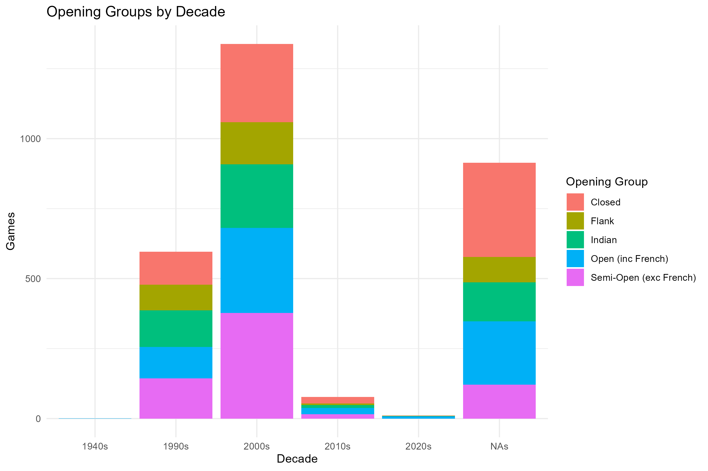
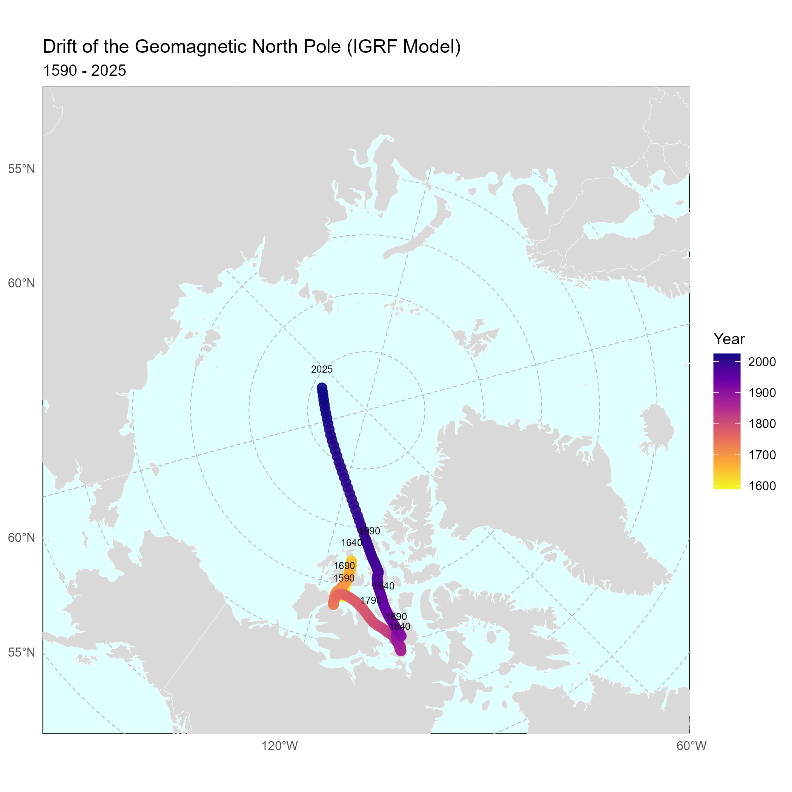
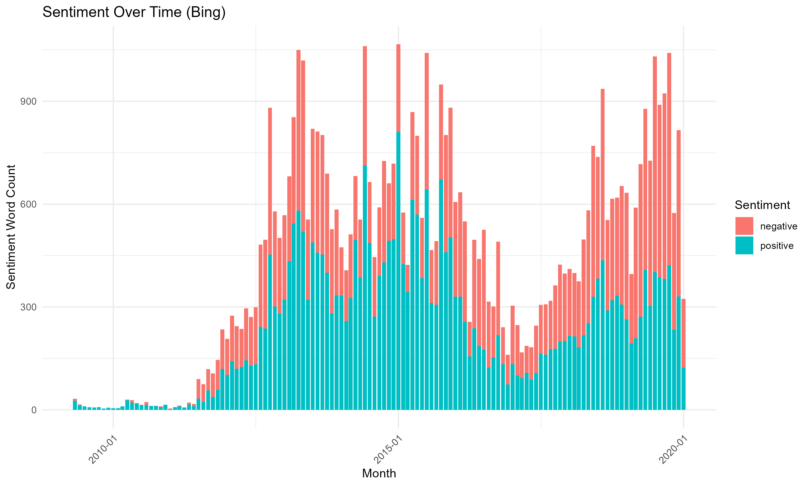

# R Data Analysis Project

A comprehensive collection of data analysis projects demonstrating advanced R programming, statistical analysis, and data visualization techniques.

## 🎯 Overview

This repository showcases three distinct data analysis projects covering diverse domains:
- **Chess Championships Analysis** - World chess championship games analysis with interactive visualizations
- **Geomagnetic Data Analysis** - Earth's magnetic pole movement tracking and visualization
- **Social Media Analytics** - Trump's Twitter data mining and sentiment analysis

## 📊 Featured Projects

### 1. Chess Championships Analysis


**Key Features:**
- Analysis of 1,000+ world championship games
- Opening popularity trends and success rates
- Interactive sunburst charts and network diagrams
- ECO code classification and temporal analysis

**Technologies:** `ggplot2`, `plotly`, `networkD3`, `dplyr`, `tidyr`

### 2. Geomagnetic Pole Tracking


**Key Features:**
- IGRF model data visualization (1590-2025)
- Polar stereographic projections
- Magnetic declination mapping
- Temporal trend analysis

**Technologies:** `sf`, `rnaturalearth`, `ggplot2`, `viridis`, `patchwork`

### 3. Donald Trump's Social Media Analytics


**Key Features:**
- Text mining and preprocessing
- Sentiment analysis with multiple lexicons
- Interactive word clouds
- Temporal pattern recognition

**Technologies:** `tidytext`, `wordcloud2`, `lubridate`, `stringr`, `scales`

## 🛠️ Technical Skills Demonstrated

### Data Manipulation & Analysis
- Advanced `dplyr` operations and data wrangling
- Time series analysis with `lubridate`
- Spatial data processing with `sf`
- Text mining and NLP with `tidytext`

### Visualization & Reporting
- Static visualizations with `ggplot2`
- Interactive plots with `plotly` and `networkD3`
- Geospatial mapping and projections
- Dashboard-style layouts with `patchwork`

### Programming Best Practices
- Modular code organization
- Error handling and data validation
- Package management and dependencies
- Reproducible analysis workflows

## 📈 Key Achievements

- **15+ unique visualization types** across static and interactive formats
- **Geospatial projections** for polar coordinate systems
- **Multi-language text processing** with proper encoding handling
- **Large dataset optimization** with efficient memory management
- **Professional documentation** with clear methodology explanations

## 🚀 Quick Start

```r
# Install required packages
source("requirements.R")

# Run individual analyses

source('Chess/Chess-analysis.r')
source('NorthPoleLocations/geomagnetic-analysis.r')
source('TrumpTweets/social-media-analysis.r')

```

## 🔧 Dependencies

```r
# Core packages
c("readr", "dplyr", "ggplot2", "lubridate", "tidyr")

# Visualization
c("plotly", "ggraph", "gganimate", "networkD3", "viridis")

# Specialized analysis
c("sf", "rnaturalearth", "tidytext", "wordcloud2")
```

## 📊 Sample Outputs

### Interactive Visualizations
- **Chess Opening Sunburst** - Hierarchical opening classification
- **Geomagnetic Pole Tracking** - Animated polar movement
- **Word Cloud Analytics** - Dynamic text visualization

### Statistical Insights
- **Opening Success Rates** by ECO classification
- **Magnetic Declination Patterns** across geographic regions  
- **Sentiment Trends** in social media content over time

## 🎓 Learning Outcomes

This project demonstrates proficiency in:
- **Statistical Computing** with R
- **Data Visualization** best practices
- **Geospatial Analysis** techniques
- **Text Mining** and sentiment analysis
- **Interactive Dashboard** development
- **Reproducible Research** methodologies

## 🤝 Professional Applications

The techniques showcased here are directly applicable to:
- Business intelligence and analytics
- Market research and consumer insights
- Scientific data analysis and reporting
- Social media monitoring and brand analysis
- Geographic information systems (GIS)

---
